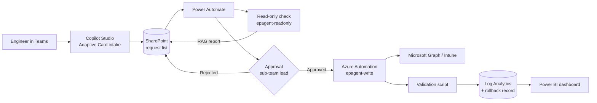

# Architecture

## Guiding principle

The agent recommends and orchestrates. It never makes an uncontrolled production change. Every write action is deterministic (a defined Graph or PowerShell call), approved by a human, and paired with a validation check and a rollback step.

## Request flow

1. **Intake** — the engineer submits a request; the agent converts it into structured fields.
2. **Store** — the request is written to SharePoint with status `Submitted`.
3. **Read-only check** — Power Automate runs a read-only script; the agent returns a Red/Amber/Green report.
4. **Approve** — any write action needs approval from the sub-team lead.
5. **Execute** — a deterministic Graph/PowerShell script performs the change.
6. **Validate** — a validation script confirms the change and attaches evidence.
7. **Log & rollback record** — action, old value, new value and rollback instruction are logged.

## Environments

| Environment | Purpose |
| --- | --- |
| Dev | Write and test scripts and flows in isolation |
| Test / Sandbox | 10-device end-to-end test |
| Pilot | Up to 50 devices, approved tenant |

Prototypes never connect to a customer production tenant.

## Identities

| Identity | Type | Graph permissions | Used by |
| --- | --- | --- | --- |
| `epagent-readonly` | Entra app registration | DeviceManagementConfiguration.Read.All, DeviceManagementServiceConfig.Read.All, DeviceManagementApps.Read.All, DeviceManagementManagedDevices.Read.All, Group.Read.All | Prerequisite checks, validation, reporting |
| `epagent-write` | Managed Identity (Azure Automation) | The matching `.ReadWrite.All` scopes | Write modules, only after approval |

## Build order

| Phase | What |
| --- | --- |
| 0 | Environments, licensing, break-glass accounts |
| 1 | Identities, Key Vault, PIM |
| 2 | SharePoint request list + Copilot Studio intake |
| 3 | Power Automate approval flow |
| 4 | Azure Automation runtime with Graph modules |
| 5 | Read-only modules (1–2), proven accurate |
| 6 | Write modules (3–7), one at a time behind approval |
| 7 | Validation & rollback (8) |
| 8 | Sandbox test → pilot → publish runbook |

## Rollback order

To reverse a full request: apps → config/compliance → hardware hashes → Autopilot profile → bootstrap objects.
