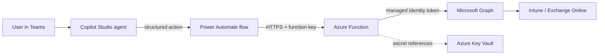

# m365-agent-security-architecture


Security architecture for an AI agent that reads and acts on Microsoft 365 through Microsoft Graph, with a reference Azure Function.

This is a sanitised reference based on agents I lead the delivery of in production (endpoint enrolment and Exchange Online administration). It contains no client or employer code.

## Architecture



Each layer has one job. The agent interprets intent, the flow orchestrates and handles approval, and the function is the only component holding Graph permissions.

## Security requirements

| Requirement | How it is met | Record |
|---|---|---|
| No stored credentials | System-assigned managed identity | [ADR 001](docs/adr/001-managed-identity.md) |
| Secrets never in code or app settings | Azure Key Vault references | [ADR 002](docs/adr/002-key-vault.md) |
| Least privilege | App-only Graph permissions, one per capability | [ADR 003](docs/adr/003-least-privilege-graph.md) |
| Untrusted input | Allowlist validation before any query is built | [Threat model](docs/threat-model.md) |
| Data minimisation | Responses reduced to the fields the agent needs | [Threat model](docs/threat-model.md) |

## Reference function

`function/GetEnrolmentStatus` is an HTTP-triggered PowerShell function that returns the enrolment and compliance status of one device.

The serial number arrives from a chat conversation, so it is untrusted. It is placed inside an OData filter string, which means an unvalidated quote would let a caller rewrite the query:

```
serialNumber eq 'X' or 1 eq 1 or serialNumber eq 'Y'    <- returns every device
```

`New-ManagedDeviceQueryUri` rejects anything outside `^[A-Za-z0-9-]{4,32}$` before the URI is built, and the tests include that injection string.

## Tests

```powershell
Invoke-Pester ./tests
```

14 tests cover input validation, filter injection, query construction, response minimisation and the missing-identity failure path.

## Deployment notes

1. Enable the system-assigned managed identity on the function app.
2. Grant it the `DeviceManagementManagedDevices.Read.All` application permission on Microsoft Graph, and nothing else.
3. Keep the function key in Key Vault and reference it from the Power Automate connection.

## Licence

MIT
